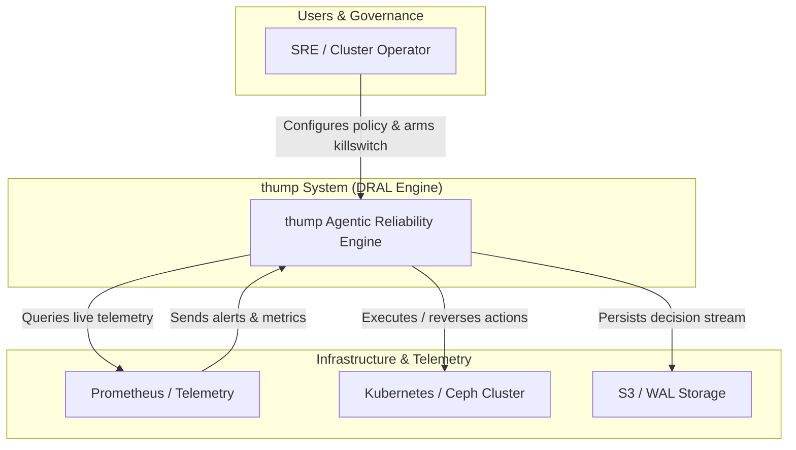
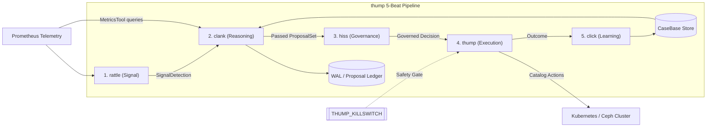
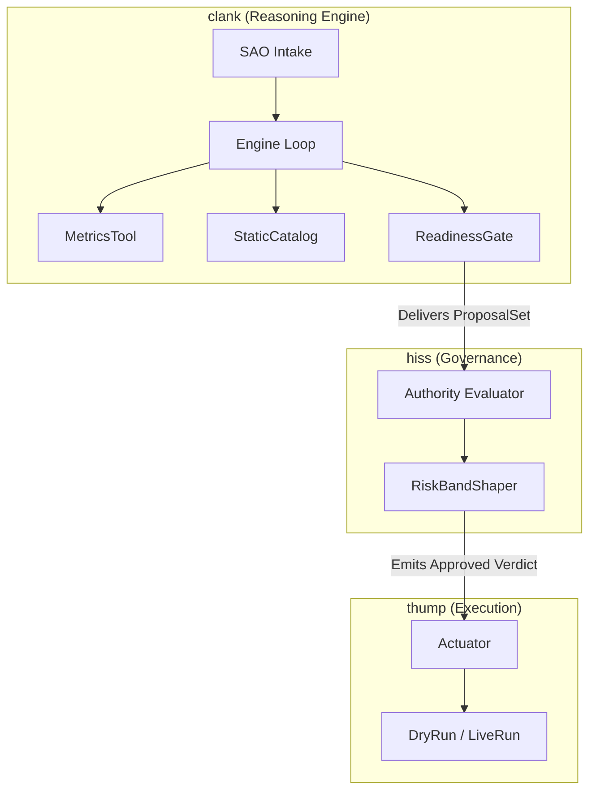
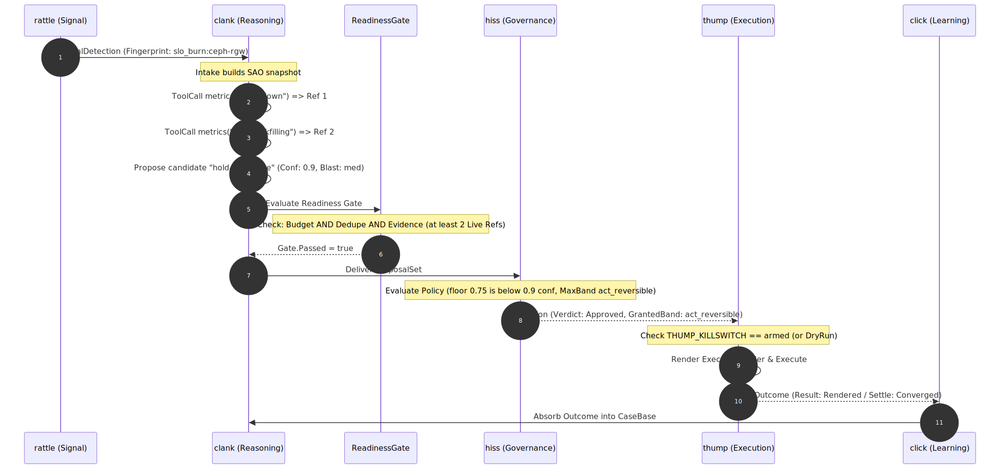
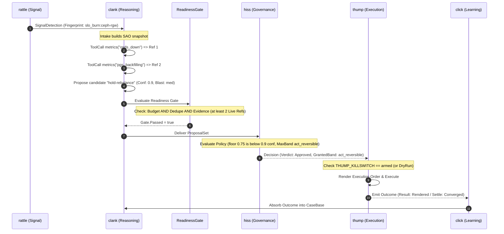
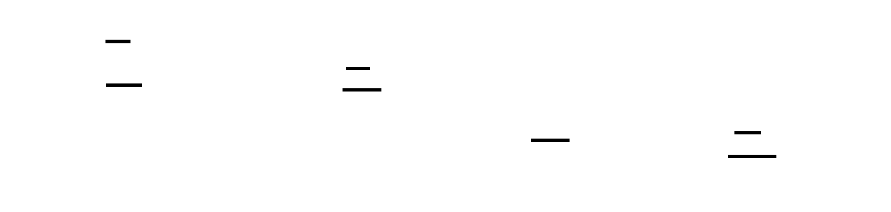

# C4 Architecture Model: `thump` Agentic SRE Engine

> **System Overview**: `thump` is a general-purpose, DRAL-based (Detect, Reason, Authorize/Govern, Act, Learn) agentic SRE system designed for Kubernetes clusters (testing against Rook/Ceph). It implements a 5-beat pipeline (`rattle` → `clank` → `hiss` → `thump` → `click`) governed by strict safety invariants (C4 / Autonomy boundaries, hard kill switch, multi-source evidence floors, and reversible contracts).

---

## Level 1: System Context Diagram





---

## Level 2: Container Diagram (The 5 Beats & Infrastructure)





---

## Level 3: Component Diagram (Golden Path Focus: `clank`, `hiss`, & `thump`)





---

## End-to-End Golden Path Sequence (`node-death` Scenario)





---

## Declarative Architecture in D2 Format



For developers using D2 (`d2 docs/architecture.d2 docs/c4-d2.svg`), here is the equivalent D2 source code:

```d2
# thump System C4 Architecture in D2
direction: right

classes: {
  beat: {
    style: {
      fill: "#e1f5fe"
      stroke: "#0288d1"
      stroke-width: 2
      border-radius: 6
    }
  }
  safety: {
    style: {
      fill: "#ffebee"
      stroke: "#d32f2f"
      stroke-dash: 3
    }
  }
}

prometheus: Prometheus Telemetry {
  shape: cylinder
}

thump_system: thump Agentic SRE {
  rattle: Beat 1: rattle (Signal) {
    class: beat
    description: "Detects reliability anomalies; emits fingerprinted SignalDetection."
  }

  clank: Beat 2: clank (Reasoning) {
    class: beat
    sao: SAO Intake
    gate: Readiness Gate (Budget & Dedupe & Evidence)
    catalog: Action Catalog Boundary
  }

  hiss: Beat 3: hiss (Governance) {
    class: beat
    policy: Policy Evaluator (Floors & Blast Ceilings)
  }

  thump_exec: Beat 4: thump (Execution) {
    class: beat
    actuator: Actuator & DryRun/LiveRun
    killswitch: THUMP_KILLSWITCH {
      class: safety
    }
  }

  click: Beat 5: click (Learning Edge) {
    class: beat
    casebase: CaseBase Engine
  }
}

cluster: Target Kubernetes / Ceph Cluster {
  shape: cloud
}

prometheus -> thump_system.rattle: "Ingests Alerts & Metrics"
thump_system.rattle -> thump_system.clank.sao: "emits SignalDetection"
prometheus -> thump_system.clank: "Live metrics queries (MetricsTool)"
thump_system.clank.gate -> thump_system.hiss.policy: "delivers ProposalSet (if Gate passes)"
thump_system.hiss.policy -> thump_system.thump_exec.actuator: "emits Governed Decision (Approved)"
thump_system.thump_exec.actuator -> cluster: "Executes catalog action (e.g. hold-rebalance)"
thump_system.thump_exec.actuator -> thump_system.click.casebase: "Outcome feedback edge"
```
